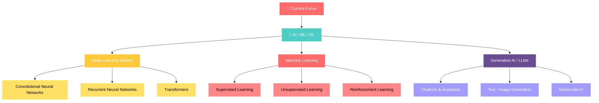

<div align="center">

# 🚀 Welcome to Vinayak Joshi's Digital Universe 🌟


[](https://visitorbadge.io/status?path=vinayakjoshi04)
[](https://github.com/vinayakjoshi04)
[](https://github.com/vinayakjoshi04)

</div>

---


## 👨‍💻 About Me

```python
class VinayakJoshi:
    def __init__(self):
        self.username = "vinayakjoshi04"
        self.name = "Vinayak Joshi"
        self.position = "AI/ML Engineer & Full-Stack Developer"
        self.education = "Computer Science Student"
        self.code = {
            "languages": ["Python", "C++"],
            "specialization": ["Machine Learning", "Deep Learning", "Web Dev"],
            "tools": ["TensorFlow", "Scikit-learn", "Flask", "React"],
            "cloud": ["Render", "Streamlit Cloud", "Vercel"]
        }
        self.current_focus = "Building AI solutions that matter"
        
    def say_hi(self):
        print("Thanks for dropping by! Let's build something amazing together!")

me = VinayakJoshi()
me.say_hi()
```

<br/>

---

## 🛠️ **Tech Arsenal**

<div align="center">

### **Programming Languages**


### **AI/ML & Data Science**


### **Web Development & Frameworks**


### **Cloud & DevOps**


### **Tools & IDEs**


</div>

---

## 🏆 **Featured Projects**

Explore my journey in machine learning and AI through these innovative projects demonstrating practical applications in healthcare, NLP, computer vision, and intelligent systems.

<div align="center">

<table>
<tr>
<td width="50%">

### 🏥 [Diabetes Risk Predictor](https://github.com/vinayakjoshi04/Diabetes-Prediction-Web)


**🎯 Purpose:** Clinical-grade diabetes risk assessment  
**🔧 Tech:** Python • Scikit-learn • Streamlit  
**📊 Results:** Accurate predictions & interactive dashboard

</td>
<td width="50%">

### 🌐 [Hybrid Image Recognition & NLP](https://github.com/vinayakjoshi04/Hybrid-Image-Recognition-and-Information-Extraction-System)


**🎯 Purpose:** OCR, image captioning, translation, and TTS in one interface  
**🔧 Tech:** Python • Streamlit • OpenCV • BLIP • Transformers • gTTS  
**📊 Results:** Seamless AI-assisted image & text processing

</td>
</tr>
<tr>
<td width="50%">

### ☁️ [VM Placement & CDN Optimizer](https://github.com/vinayakjoshi04/VM_Placement_and_CDN_Optimization)


**🎯 Purpose:** Reduce latency & cost via ML-based VM/CDN optimization  
**🔧 Tech:** Python • Scikit-learn • LightGBM • XGBoost • PuLP • Plotly  
**📊 Results:** Real-time analytics dashboard with predictive modeling

</td>
<td width="50%">

### 🎬 [AI Story Generator](https://github.com/vinayakjoshi04/AI-Story-Generator-GenAI-Project)


**🎯 Purpose:** Multi-language story generation with Google Gemini API  
**🔧 Tech:** Python • Flask • NLP • Text-to-Speech • PDF/TXT export  
**📊 Results:** Interactive storytelling platform with advanced customization

</td>
</tr>
<tr>
<td width="50%">

### 🍽️ [Mom's Kitchen Food Delivery](https://github.com/vinayakjoshi04/Moms_Kitchen)


**🎯 Purpose:** End-to-end food delivery platform  
**🔧 Tech:** React • Supabase • JavaScript • UI/UX Design  
**📊 Results:** Real-time order management & responsive interface

</td>
<td width="50%">

### 🌧️ [Rain Predictor](https://github.com/vinayakjoshi04/Rain-Predictor)


**🎯 Purpose:** Predict rainfall using meteorological data  
**🔧 Tech:** Python • Flask • Scikit-learn • XGBoost  
**📊 Results:** 82.43% accuracy with intuitive web interface

</td>
</tr>
</table>

</div>

---


## 📊 **GitHub Analytics**

<div align="center">


</div>

<div align="center">


</div>

---

## 🏅 **Achievements & Experience**

Explore my journey in machine learning, AI, and full-stack development through achievements, milestones, and practical project experience.

<div align="center">

| 🎯 **Achievement / Experience** | 📊 **Details** | 🌟 **Impact** |
|:---|:---|:---|
| **🏆 SIH 2023 & SIH 2025 Participant** | National hackathon competitor | Innovation & teamwork excellence |
| **🤖 ML & AI Projects Portfolio** | Deployed 7+ production-ready ML & web applications across healthcare, education, and entertainment | Real-world problem solving |
| **🌐 Full-Stack Development** | End-to-end applications with React, Flask, Supabase, Streamlit | Complete solution delivery |
| **📈 Open Source & Kaggle Contributor** | Multiple public repositories & competitions | Community contribution & skill growth |
| **🎓 Continuous Learner** | Strong foundation in Machine Learning and currently deep diving into Deep Learning | Staying ahead of trends |
| **🎯 Academic Excellence** | Computer Science and Engineering | Strong technical foundation |

</div>

---

## 🌟 **Current Mission**

<div align="center">



</div>

---

## 🤝 **Let's Connect & Collaborate**

<div align="center">


### **Ready to build something extraordinary together?** 🚀

<p>
<a href="https://www.linkedin.com/in/vinayak-joshi-99521528b/" target="_blank">

</a>
<a href="mailto:vinayakjoshi2004@gmail.com" target="_blank">

</a>
<a href="https://github.com/vinayakjoshi04" target="_blank">

</a>
<a href="https://vinayak-s-portfolio-website.vercel.app/" target="_blank">

</a>
</p>

### **💡 Open To:**
**🚀 Cutting-edge AI/ML Projects** • **💼 Career Opportunities** • **🤝 Collaborations** • **📚 Knowledge Sharing**

---


> **"Innovation distinguishes between a leader and a follower."**  
> *– Steve Jobs*

<br>


</div>
