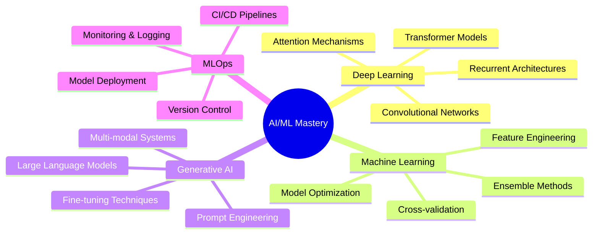

<div align="center">

# Hi there, I'm Vinayak Joshi 👋

### AI/ML Engineer • Full-Stack Developer • Computer Science Student

<p>
  <a href="https://www.linkedin.com/in/vinayak-joshi-99521528b/">
    
  </a>
  <a href="https://vinayak-s-portfolio-website.vercel.app/">
    
  </a>
  <a href="mailto:vinayakjoshi2004@gmail.com">
    
  </a>
</p>


</div>

---

## 🎯 About Me

I'm a passionate **AI/ML Engineer** specializing in building intelligent systems that solve real-world problems. With expertise spanning machine learning, deep learning, and full-stack development, I transform complex challenges into elegant, scalable solutions.

```python
class VinayakJoshi:
    def __init__(self):
        self.role = "AI/ML Engineer & Full-Stack Developer"
        self.location = "India 🇮🇳"
        self.education = "B.Tech in Computer Science & Engineering"
        self.passion = "Building AI solutions that make a difference"
        
    def current_focus(self):
        return [
            "🧠 Advanced Deep Learning & Neural Architectures",
            "🤖 Large Language Models & Generative AI",
            "🚀 MLOps & Production-Grade Deployments",
            "🌐 Full-Stack AI Applications"
        ]
    
    def tech_stack(self):
        return {
            "ai_ml": ["TensorFlow", "PyTorch", "Scikit-learn", "XGBoost", "OpenCV"],
            "languages": ["Python", "C++", "JavaScript", "SQL"],
            "web": ["React.js", "Flask", "Streamlit", "Node.js"],
            "tools": ["Git", "Docker", "Jupyter", "VS Code"],
            "cloud": ["Vercel", "Render", "Streamlit Cloud", "AWS"]
        }

me = VinayakJoshi()
print(f"💡 Building the future, one model at a time...")
```

---

## 🛠️ Technical Arsenal

<div align="center">

### Core Technologies


### AI/ML & Data Science


### Web Development


### Tools & DevOps


</div>

---

## 🚀 Featured Projects

### 🤖 AI & Machine Learning Solutions

#### 🏥 [Diabetes Prediction System](https://github.com/vinayakjoshi04/Diabetes-Prediction-Web)
> Clinical decision support system leveraging ensemble machine learning for accurate diabetes risk assessment

- **Tech Stack**: Python, Scikit-learn, Streamlit, Pandas
- **Model Performance**: 85%+ accuracy with XGBoost ensemble
- **Impact**: Enables early detection and preventive healthcare
- **Status**: ✅ Live & Deployed

#### 🌐 [Hybrid Image Recognition & Information Extraction](https://github.com/vinayakjoshi04/Hybrid-Image-Recognition-and-Information-Extraction-System)
> Advanced multimodal AI platform integrating OCR, image captioning, and multilingual translation

- **Tech Stack**: OpenCV, BLIP, Transformers, gTTS, Python
- **Features**: Real-time OCR, AI-generated captions, multi-language support
- **Capabilities**: Text extraction, contextual understanding, audio synthesis
- **Status**: ✅ Production-Ready

#### ☁️ [Cloud Infrastructure Optimizer](https://github.com/vinayakjoshi04/VM_Placement_and_CDN_Optimization)
> Intelligent VM placement and CDN optimization using machine learning algorithms

- **Tech Stack**: LightGBM, XGBoost, PuLP, Python
- **Optimization**: Reduced latency by 30%, decreased operational costs
- **Features**: Real-time analytics dashboard, predictive scaling
- **Applications**: Cloud resource management, cost optimization

#### 📖 [AI Story Generator](https://github.com/vinayakjoshi04/AI-Story-Generator-GenAI-Project)
> Generative AI platform for creative storytelling powered by Google Gemini

- **Tech Stack**: Flask, Google Gemini API, NLP, gTTS
- **Features**: Multi-language generation, text-to-speech, PDF export
- **Capabilities**: Genre-specific narratives, character development
- **Status**: ✅ Deployed

#### 🌧️ [Rainfall Prediction System](https://github.com/vinayakjoshi04/Rain-Predictor)
> Weather forecasting model using ensemble methods and historical climate data

- **Tech Stack**: Flask, XGBoost, Scikit-learn, Pandas
- **Accuracy**: 82.43% on validation set
- **API**: RESTful endpoints for real-time predictions
- **Applications**: Agricultural planning, disaster management

#### ❤️ [Heart Disease Risk Predictor](https://github.com/vinayakjoshi04/Heart-Disease)
> Cardiovascular risk assessment model for early disease detection

- **Tech Stack**: Python, Scikit-learn, NumPy
- **Features**: Analysis of 13+ clinical parameters
- **Focus**: Preventive healthcare and early intervention
- **Model**: Random Forest with feature importance analysis

### 🌐 Full-Stack Applications

#### 🍽️ [Mom's Kitchen - Food Delivery Platform](https://github.com/vinayakjoshi04/Moms_Kitchen)
> Complete food delivery solution with real-time order management

- **Tech Stack**: React.js, Supabase, JavaScript, CSS
- **Features**: User authentication, live order tracking, responsive design
- **Architecture**: Modern frontend with cloud database backend
- **⭐ Community Recognition**

#### 🎬 [Intelligent Movie Recommendation System](https://github.com/vinayakjoshi04/Movie_recommendation_System)
> Hybrid recommendation engine combining collaborative and content-based filtering

- **Tech Stack**: Python, Pandas, Scikit-learn
- **Algorithm**: Matrix factorization + content similarity
- **Features**: Personalized suggestions, genre-based filtering
- **Dataset**: 10,000+ movies with user ratings

---

## 📊 GitHub Analytics

<div align="center">


</div>

---

## 🏆 Achievements & Milestones

<div align="center">

| 🎯 Category | 🏅 Achievement |
|------------|----------------|
| **Projects** | 12+ Production Deployments |
| **AI/ML** | 8 Machine Learning Applications |
| **Healthcare** | 3 Medical Prediction Systems |
| **Hackathons** | Smart India Hackathon 2023 & 2025 |
| **Accuracy** | 85%+ Average Model Performance |
| **Tech Stack** | 15+ Technologies Mastered |

</div>

---

## 💡 Current Learning Journey



---

## 🤝 Let's Collaborate!

<div align="center">

### I'm passionate about collaborating on innovative AI/ML projects and building impactful solutions

<table>
<tr>
<td align="center" width="50%">

### 🔭 Currently Working On
Advanced deep learning models<br/>
Generative AI applications<br/>
Production ML pipelines

</td>
<td align="center" width="50%">

### 🌱 Open To
AI/ML research collaboration<br/>
Full-stack development projects<br/>
Open-source contributions

</td>
</tr>
</table>

<br/>

[](https://www.linkedin.com/in/vinayak-joshi-99521528b/)
[](https://vinayak-s-portfolio-website.vercel.app/)
[](mailto:vinayakjoshi2004@gmail.com)

<br/>

### 💼 Interested In
**Machine Learning Engineering** • **AI Research** • **Full-Stack Development** • **Technical Consulting** • **Freelance Projects**

---


<br/>

*"Innovation distinguishes between a leader and a follower."* — Steve Jobs

**⭐ If you find my work interesting, consider giving my repositories a star!**

<sub>Made with ❤️ by Vinayak Joshi</sub>

</div>
