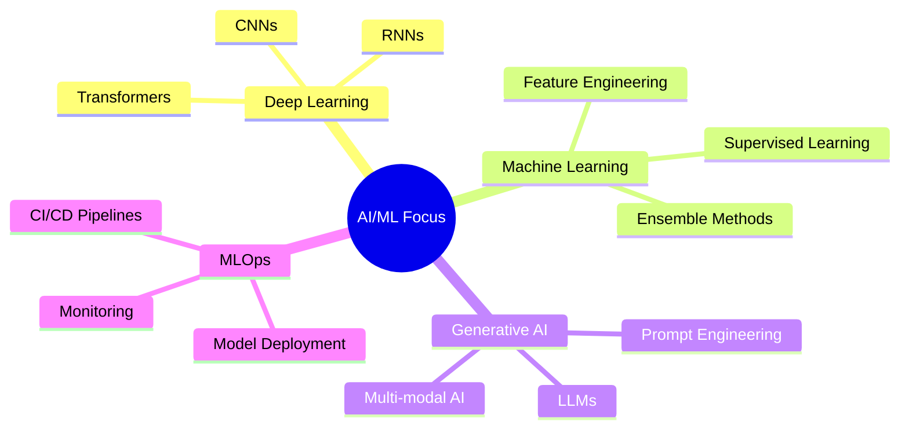

<div align="center">

# 👋 Hi, I'm Vinayak Joshi

### AI/ML Engineer | Full-Stack Developer | Computer Science Student

<p>
  <a href="https://www.linkedin.com/in/vinayak-joshi-99521528b/">
    
  </a>
  <a href="https://vinayak-s-portfolio-website.vercel.app/">
    
  </a>
  <a href="mailto:vinayakjoshi2004@gmail.com">
    
  </a>
</p>


</div>

---

## 🚀 About Me

```python
class VinayakJoshi:
    def __init__(self):
        self.role = "AI/ML Engineer & Full-Stack Developer"
        self.location = "India"
        self.education = "B.Tech in Computer Science & Engineering"
        self.focus = ["Machine Learning", "Deep Learning", "Web Development"]
        self.currently_learning = ["Advanced Deep Learning", "MLOps", "LLMs"]
        
    def get_tech_stack(self):
        return {
            "languages": ["Python", "C++", "JavaScript", "SQL"],
            "ml_frameworks": ["TensorFlow", "PyTorch", "Scikit-learn", "XGBoost"],
            "web": ["React.js", "Flask", "Streamlit", "Node.js"],
            "tools": ["Git", "Docker", "VS Code", "Jupyter"],
            "cloud": ["Vercel", "Render", "Streamlit Cloud"]
        }
    
    def say_hi(self):
        print("Thanks for visiting! Let's build something amazing together 🚀")

me = VinayakJoshi()
me.say_hi()
```

---

## 🛠️ Tech Stack

### Languages & Core


### AI/ML & Data Science


### Web Development


### Tools & Platforms


---

## 💼 Featured Projects

### 🤖 AI & Machine Learning

<table>
<tr>
<td width="50%">

#### 🏥 [Diabetes Prediction System](https://github.com/vinayakjoshi04/Diabetes-Prediction-Web)
Clinical decision support system using ensemble ML methods
- **Tech**: Python, Scikit-learn, Streamlit
- **Accuracy**: 85%+
- **Status**: ✅ Deployed

</td>
<td width="50%">

#### 🌐 [Hybrid Image Recognition](https://github.com/vinayakjoshi04/Hybrid-Image-Recognition-and-Information-Extraction-System)
Multimodal AI platform with OCR, captioning & translation
- **Tech**: OpenCV, BLIP, Transformers, gTTS
- **Features**: Multi-language support
- **Status**: ✅ Production

</td>
</tr>

<tr>
<td width="50%">

#### ☁️ [Cloud Infrastructure Optimizer](https://github.com/vinayakjoshi04/VM_Placement_and_CDN_Optimization)
ML-based VM placement & CDN optimization
- **Tech**: LightGBM, XGBoost, PuLP
- **Impact**: Reduced latency & costs
- **Features**: Real-time analytics dashboard

</td>
<td width="50%">

#### 📖 [AI Story Generator](https://github.com/vinayakjoshi04/AI-Story-Generator-GenAI-Project)
Generative AI platform for creative writing
- **Tech**: Flask, Google Gemini API, NLP
- **Features**: Multi-language, TTS, PDF export
- **Status**: ✅ Deployed

</td>
</tr>

<tr>
<td width="50%">

#### 🌧️ [Rainfall Predictor](https://github.com/vinayakjoshi04/Rain-Predictor)
Weather forecasting with ensemble methods
- **Tech**: Flask, XGBoost, Scikit-learn
- **Accuracy**: 82.43%
- **Features**: RESTful API

</td>
<td width="50%">

#### ❤️ [Heart Disease Predictor](https://github.com/vinayakjoshi04/Heart-Disease)
Cardiovascular risk assessment model
- **Tech**: Python, Scikit-learn
- **Features**: 13+ clinical parameters
- **Focus**: Early detection

</td>
</tr>
</table>

### 🌐 Full-Stack Applications

<table>
<tr>
<td width="50%">

#### 🍽️ [Mom's Kitchen](https://github.com/vinayakjoshi04/Moms_Kitchen)
Food delivery platform with real-time ordering
- **Tech**: React.js, Supabase, JavaScript
- **Features**: Authentication, order tracking
- **⭐ 1 Star**

</td>
<td width="50%">

#### 🎬 [Movie Recommendation System](https://github.com/vinayakjoshi04/Movie_recommendation_System)
Hybrid recommendation engine
- **Tech**: Python, Collaborative Filtering
- **Approach**: Content + Collaborative
- **Features**: Personalized suggestions

</td>
</tr>
</table>

---

## 📊 GitHub Statistics

<div align="center">
  
  
</div>

<div align="center">
  
</div>

---

## 🏆 Achievements & Recognition

<table>
<tr>
<td align="center" width="33%">

### 🏅 Hackathons
**Smart India Hackathon**
- SIH 2025 Participant
- SIH 2023 Participant

</td>
<td align="center" width="33%">

### 🚀 Projects
**12+ Deployed Apps**
- 8 ML/AI Projects
- 3 Healthcare Systems
- 2 Full-Stack Apps

</td>
<td align="center" width="33%">

### 📚 Learning
**Continuous Growth**
- Deep Learning
- MLOps & Deployment
- Large Language Models

</td>
</tr>
</table>

---

## 📈 Current Focus



---

## 🤝 Let's Connect!

<div align="center">

### I'm always open to interesting projects and collaborations!

[](https://www.linkedin.com/in/vinayak-joshi-99521528b/)
[](https://vinayak-s-portfolio-website.vercel.app/)
[](mailto:vinayakjoshi2004@gmail.com)

### 💡 Open To:
**AI/ML Projects** • **Full-Stack Development** • **Open Source Contributions** • **Research Collaborations**

---


*"The best way to predict the future is to invent it."* — Alan Kay

⭐️ From [vinayakjoshi04](https://github.com/vinayakjoshi04)

</div>
