<div align="center">

# 🚀 Welcome to Vinayak Joshi's Digital Universe 🌟


[](https://visitorbadge.io/status?path=vinayakjoshi04)
[](https://github.com/vinayakjoshi04)
[](https://github.com/vinayakjoshi04)

</div>

---


## 👨‍💻 About Me

```python
class VinayakJoshi:
    def __init__(self):
        self.username = "vinayakjoshi04"
        self.name = "Vinayak Joshi"
        self.position = "AI/ML Engineer & Full-Stack Developer"
        self.education = "Computer Science Student"
        self.code = {
            "languages": ["Python", "C++"],
            "specialization": ["Machine Learning", "Deep Learning", "Web Dev"],
            "tools": ["TensorFlow", "Scikit-learn", "Flask", "React"],
            "cloud": ["Render", "Streamlit Cloud", "Vercel"]
        }
        self.current_focus = "Building AI solutions that matter"
        
    def say_hi(self):
        print("Thanks for dropping by! Let's build something amazing together!")

me = VinayakJoshi()
me.say_hi()
```

<br/>

---

## 🛠️ **Tech Arsenal**

<div align="center">

### **Programming Languages**


### **AI/ML & Data Science**


### **Web Development & Frameworks**


### **Cloud & DevOps**


### **Tools & IDEs**


</div>

---

## 🏆 **Featured Projects**

<div align="center">

<table>
<tr>
<td width="50%">

### 🏥 [Heart Disease Prediction](https://github.com/vinayakjoshi04/Heart-Disease)


**🎯 Purpose:** Revolutionary ML model for early heart disease detection  
**🔧 Tech:** Python • Scikit-learn • Pandas • NumPy  
**📊 Results:** 95%+ accuracy in medical diagnosis prediction  
**💡 Impact:** Potentially saving lives through early detection

</td>
<td width="50%">

### 🚗 [Car Price Predictor](https://github.com/vinayakjoshi04/Car-Price-Predictor)


**🎯 Purpose:** Intelligent automotive pricing solution  
**🔧 Tech:** Python • Advanced Regression • Feature Engineering  
**📊 Results:** Accurate price predictions with interactive visualizations  
**💡 Impact:** Helping consumers make informed car buying decisions

</td>
</tr>
<tr>
<td width="50%">

### 🍽️ [Mom's Kitchen](https://github.com/vinayakjoshi04/Moms_Kitchen)


**🎯 Purpose:** Complete food delivery ecosystem  
**🔧 Tech:** JavaScript • Node.js • Express • MongoDB  
**📊 Results:** User-friendly interface with smart recommendations  
**💡 Impact:** Connecting food lovers with amazing restaurants

</td>
<td width="50%">

### 🎬 [Movie Recommendation Engine](https://github.com/vinayakjoshi04/Movie_recommendation_System)


**🎯 Purpose:** Personalized movie discovery platform  
**🔧 Tech:** Python • Collaborative Filtering • Content-Based Filtering  
**📊 Results:** Highly accurate personalized recommendations  
**💡 Impact:** Enhancing entertainment experience for users

</tr>
<tr>
<td width="50%">

### 📧 [Spam Detection System](https://github.com/vinayakjoshi04/Spam-Mail)


**🎯 Purpose:** Advanced email security solution  
**🔧 Tech:** Python • NLP • Text Processing • Classification  
**📊 Results:** 98%+ accuracy in spam detection  
**💡 Impact:** Protecting users from malicious email content

</td>
<td width="50%">

### 🏆 [SIH 2023 Innovation](https://github.com/vinayakjoshi04/SIH2023)


**🎯 Purpose:** National-level problem-solving challenge  
**🔧 Tech:** JavaScript • Collaborative Development • Innovation  
**📊 Results:** Successfully participated in prestigious competition  
**💡 Impact:** Contributing solutions for national challenges

</td>
</tr>
</table>

</div>

---

## 📊 **GitHub Analytics**

<div align="center">


</div>

<div align="center">


</div>

---

## 🏅 **Achievements & Milestones**

<div align="center">

| 🎯 **Achievement** | 📊 **Details** | 🌟 **Impact** |
|:---|:---|:---|
| **🏆 SIH 2023 Participant** | National hackathon competitor | Innovation & teamwork excellence |
| **🤖 ML Projects Portfolio** | 5+ production-ready models | Real-world problem solving |
| **🌐 Full-Stack Development** | End-to-end applications | Complete solution delivery |
| **📈 Open Source Contributor** | Multiple public repositories | Community contribution |
| **🎓 Continuous Learner** | Latest tech stack adoption | Staying ahead of trends |

</div>

---

## 🌟 **Current Mission**

```mermaid
graph TD
    A[🚀 Current Focus] --> B[🤖 Advanced AI/ML]
    A --> C[🌐 Modern Web Frameworks]
    A --> D[☁️ Cloud Architecture]
    A --> E[📊 Big Data Analytics]
    
    B --> F[Deep Learning Models]
    B --> G[Neural Networks]
    
    C --> H[React.js Mastery]
    C --> I[Next.js Applications]
    
    D --> J[AWS Solutions]
    D --> K[Microservices]
    
    E --> L[Real-time Processing]
    E --> M[Data Pipelines]
    
    style A fill:#ff6b6b,stroke:#fff,stroke-width:3px,color:#fff
    style B fill:#4ecdc4,stroke:#fff,stroke-width:2px,color:#fff
    style C fill:#45b7d1,stroke:#fff,stroke-width:2px,color:#fff
    style D fill:#96ceb4,stroke:#fff,stroke-width:2px,color:#fff
    style E fill:#feca57,stroke:#fff,stroke-width:2px,color:#fff
```

<div align="center">



</div>

---

## 🤝 **Let's Connect & Collaborate**

<div align="center">


### **Ready to build something extraordinary together?**

[](https://www.linkedin.com/in/vinayak-joshi-99521528b/)
[](mailto:vinayakjoshi2004@gmail.com)
[](https://github.com/vinayakjoshi04)
[](#)

### **💡 Open to:**
**🚀 Innovative AI/ML Projects** • **💼 Job Opportunities** • **🤝 Collaboration** • **📚 Knowledge Sharing**

---


### **"Innovation distinguishes between a leader and a follower."** *- Steve Jobs*


</div>
